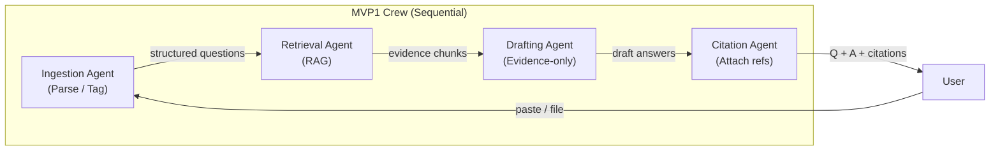
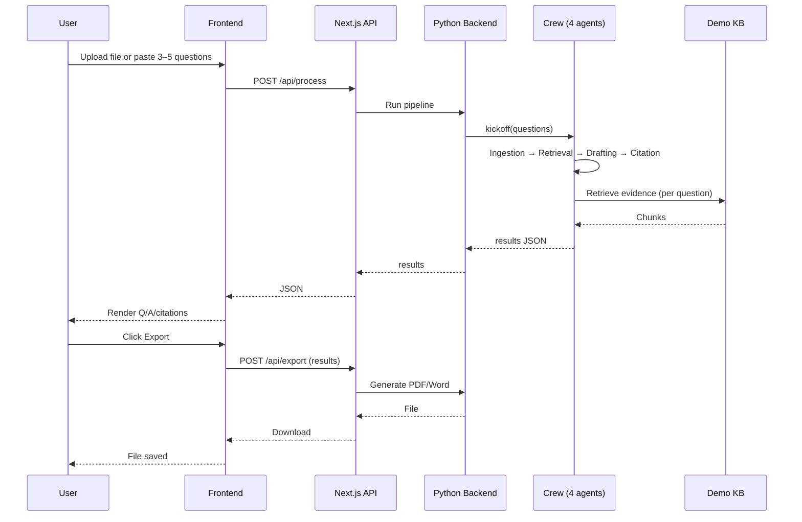

# MVP1 System Architecture Document: B2B Security Questionnaire Automation

**Product Name**: B2B Security Questionnaire Automation  
**Architecture Focus**: Lean MVP1 — 60–90 second demo with evidence-grade cited answers; CrewAI 4-agent pipeline, single-page UI  
**Document Status**: MVP1 Draft v1.0  
**Adapter**: CrewAI (AAMAD_ADAPTER=crewai)  
**Scope**: Single demo scenario only (upload/paste → process → results → export); all review queue, risk UI, auth, and production NFRs deferred to [sad.md](sad.md)

**Parent documents**: [project-context/1.define/prd.md](../1.define/prd.md), [project-context/1.define/mr.md](../1.define/mr.md), [project-context/2.build/sad.md](sad.md)

---

## Demo Scenario (Single E2E)

### Chosen Scenario: “First draft in under 90 seconds”

**Value proposition demonstrated**: Manual security questionnaires take 15–40 hours (PRD §1, MR); we show a first draft with **evidence-grade, cited answers** in under 90 seconds.

**Script (60–90 seconds)**:

| Step | Action | Time | What the audience sees |
| :--- | :----- | :--- | :--------------------- |
| 1 | Present problem | 10s | “Security questionnaires add 2–3 weeks to our sales cycle. We’re going to cut that to under 90 seconds for a first draft.” |
| 2 | Upload or paste | 5–10s | User uploads a **prepared demo file** (3–5 SOC 2-style questions) or pastes 3–5 questions into the UI. |
| 3 | Process | 45–60s | Single “Process” action; progress indicator (e.g. “Parsing…” → “Finding evidence…” → “Drafting answers…”). Pipeline runs: parse → retrieve → draft → cite. |
| 4 | Show results | 15–20s | Results view: each **question + draft answer + citation** (document/section/snippet). Emphasize: “Every claim is tied to a source.” |
| 5 | Export | 5–10s | One-click export: one document (e.g. PDF or Word) with answers and an evidence snippet/citation list. “Ready to send to the buyer.” |

**Out of scope for MVP1 demo**: Full review queue, risk scoring UI, multi-format upload, auth, multi-tenant, full audit log (PRD P0-3, P0-4). These remain in [sad.md](sad.md) for post-demo build.

---

## 1. MVP1 Architecture Philosophy & Principles

### MVP1 Design Principles

**Demo-first**: Every design choice optimizes for the single 60–90s scenario above. No scope beyond what the audience sees (PRD §8 Phase 1 success criteria).

**Evidence = differentiator**: The moment that proves value is “answer + citation visible in under 90s.” RAG and citation attachment are mandatory; risk/review can be simulated or omitted for demo (PRD §3, P0-2; MR §2 — claim-level citations standard for SOC 2, GDPR, HIPAA).

**Reproducibility First**: Agent memory is disabled (memory=false) for deterministic, auditable demo runs. Same demo questionnaire + same KB produces same output (adapter-crewai rules).

**Deterministic demo**: Use a **fixed demo questionnaire** (3–5 questions) and a **small, curated knowledge base** (5–10 evidence chunks) so the pipeline is fast, repeatable, and reliable. Precomputed embeddings for speed (MR §2).

**15-day build**: Prefer one format (CSV or pasted text), four agents only, minimal UI (single flow), minimal infra (local or single deploy) (PRD §8 Phase 1).

### Core vs. Future (MVP1 vs Full MVP)

| Phase | Scope | Rationale |
| :---- | :---- | :-------- |
| **MVP1 (this doc)** | Single demo: upload/paste → 4-agent pipeline (Ingestion, Retrieval, Drafting, Citation) → results view → export. No auth, no review queue, no risk UI. 3–5 questions, &lt; 60s pipeline. | Prove core value: evidence-grade cited answers in under 90s |
| **Full MVP (sad.md)** | Full P0: 6 agents (+ Risk, Review Router), review queue, approve/edit/reject, RBAC, audit log, 200+ questions, 15 min target. | Production-ready workflow per PRD §4, §8 |

**MVP1 Scope Boundaries** (PRD §4 P0; explicit exclusions):

- **In**: One intake (paste or one file format), 4 agents, small demo KB (5–10 chunks), single-page UI, one export format, pipeline &lt; 60s for 3–5 questions.
- **Out**: Auth, review queue, risk UI, multiple formats, 200+ questions, full audit log, production CI/CD, multi-tenant.

### Technical Architecture Decisions

**Decision 1: Reduced agent set (4 agents)**

Ingestion → Retrieval → Drafting → Citation only. No Risk or Review Router in the critical path so the demo stays within 60–90s and the 15-day build stays feasible. Risk and Review Router are added in full MVP (sad.md) (PRD §3; MR §2).

**Decision 2: Single intake path (paste or one file format)**

Accept either (a) upload of one demo questionnaire file (CSV or simple structured format), or (b) paste of 3–5 questions. Avoid heavy Word/PDF parsing in 15 days unless a single library gives quick wins. Full MVP adds Word and optional PDF/Excel (PRD P1-1).

**Decision 3: In-memory or minimal DB for demo**

Pipeline and export can be stateless (in-memory/session); optional SQLite with one table (e.g. `demo_runs`) for replay or debugging only. No multi-tenant or audit persistence required for the demo. Full MVP uses full schema and audit log (PRD §3).

**Decision 4: Single-page frontend (no assistant-ui requirement for MVP1)**

One screen: input (upload/paste) → “Process” → results (Q/A/citation) → “Export.” Custom flow is sufficient; assistant-ui can be adopted in full MVP for chat-based or richer UX (PRD §6).

**Decision 5: Python backend with single API surface**

CrewAI is Python; backend (FastAPI or Flask) or Next.js API route that invokes Python runs the crew. Single primary endpoint `POST /api/process` and `POST /api/export`. Optional streaming progress for demo UX (PRD §3).

---

## 2. Multi-Agent System Specification (MVP1)

### Agent Architecture

Four specialized agents in a sequential pipeline. Full MVP adds Risk and Review Router (PRD §3).



### Agent Definitions (MVP1)

**Agent 1: Ingestion Agent**

| Attribute | Value |
| :-------- | :---- |
| role | "Questionnaire intake and normalization specialist" |
| goal | "Parse or accept 3–5 questions into a structured list with optional domain/framework tag so every question is machine-readable and mappable to the knowledge base" |
| backstory | "Experienced in vendor risk formats (SIG, SOC 2, custom); knows common schema and question banks; focuses on minimal parsing for demo speed." |
| tools | [document_parser or text_parser, question_tagger] |
| llm | OpenAI GPT-4-class or equivalent (per org default) |
| memory | false |
| allow_delegation | false |
| verbose | false (production), true (development) |
| max_iter | 6 |
| max_execution_time | 60 seconds |
| max_retry_limit | 2 |
| respect_context_window | true |

*PRD Traceability*: PRD §3 — Ingestion Agent; PRD P0-1 (questionnaire ingestion and parsing).

**Agent 2: Retrieval Agent**

| Attribute | Value |
| :-------- | :---- |
| role | "Evidence retrieval specialist" |
| goal | "Return evidence chunks for each question from the demo knowledge base with document id, section, and snippet; never invent content" |
| backstory | "Security/compliance librarian; maintains versioned policy and evidence; uses only approved demo KB for MVP1." |
| tools | [knowledge_base_search, evidence_retriever] |
| llm | OpenAI GPT-4-class or equivalent |
| memory | false |
| allow_delegation | false |
| verbose | false |
| max_iter | 6 |
| max_execution_time | 30 seconds |
| max_retry_limit | 2 |
| respect_context_window | true |

*PRD Traceability*: PRD §3 — Retrieval Agent; PRD P0-2 (evidence retrieval and citation-bound drafting).

**Agent 3: Drafting Agent**

| Attribute | Value |
| :-------- | :---- |
| role | "Answer author (evidence-bound)" |
| goal | "Produce draft answers using exclusively retrieved evidence; no unsupported claims" |
| backstory | "Technical writer for security and compliance; writes only from sources; refuses to assert without evidence." |
| tools | [answer_drafter] |
| llm | OpenAI GPT-4-class or equivalent |
| memory | false |
| allow_delegation | false |
| verbose | false |
| max_iter | 6 |
| max_execution_time | 90 seconds |
| max_retry_limit | 2 |
| respect_context_window | true |

*PRD Traceability*: PRD §3 — Drafting Agent; PRD P0-2.

**Agent 4: Citation Agent**

| Attribute | Value |
| :-------- | :---- |
| role | "Citation and validation specialist" |
| goal | "Attach claim-level citations (document, section, snippet) to every factual claim; refuse or flag when evidence is missing" |
| backstory | "Audit-oriented; ensures every statement traces to a source; flags gaps for full MVP review workflow." |
| tools | [citation_attacher, coverage_validator] |
| llm | OpenAI GPT-4-class or equivalent |
| memory | false |
| allow_delegation | false |
| verbose | false |
| max_iter | 6 |
| max_execution_time | 60 seconds |
| max_retry_limit | 2 |
| respect_context_window | true |

*PRD Traceability*: PRD §3 — Citation Agent; PRD P0-2.

### Task Orchestration (MVP1)

Tasks execute sequentially. Context passed via Task.context; no conversation memory (adapter-crewai).

**Task 1: Question intake and normalization**

| Attribute | Value |
| :-------- | :---- |
| id | question_intake |
| description | Parse uploaded file or pasted text into a structured list of questions with optional domain/framework tag. Output machine-readable question set. |
| agent | Ingestion Agent |
| expected_output | JSON array: [{ "id", "text", "domain?" }]. Passed to next task via context. |
| context | User-provided file or pasted text from the request. |
| human_input | false |

**Task 2: Evidence retrieval**

| Attribute | Value |
| :-------- | :---- |
| id | evidence_retrieval |
| description | For each question, retrieve top-k evidence chunks from the demo knowledge base (document id, section, text/snippet). |
| agent | Retrieval Agent |
| expected_output | JSON structure: questions with attached evidence arrays. Passed to next task via context. |
| context | [question_intake] — receives structured questions from Task 1. |
| human_input | false |

**Task 3: Answer drafting**

| Attribute | Value |
| :-------- | :---- |
| id | answer_drafting |
| description | Generate draft answer for each question using only retrieved evidence; no unsupported claims. |
| agent | Drafting Agent |
| expected_output | JSON array: questions with draft answer text per question. |
| context | [question_intake, evidence_retrieval]. |
| human_input | false |

**Task 4: Citation attachment**

| Attribute | Value |
| :-------- | :---- |
| id | citation_attachment |
| description | Attach claim-level citations (document, section, snippet) to each answer; flag or refuse when evidence missing. |
| agent | Citation Agent |
| expected_output | Final payload: list of { question_id, question_text, answer, citations: [{ document, section, snippet }] } for frontend and export. |
| context | [question_intake, evidence_retrieval, answer_drafting]. |
| human_input | false |

**Error handling and retry policy**

- On agent task failure: retry with exponential backoff up to max_retry_limit (2).
- On parsing or retrieval failure: return clear error message to user; no silent failure.
- On persistent failure: return partial output with "Incomplete — [reason]" marker where applicable.
- Pipeline must complete in **&lt; 60 seconds** for 3–5 questions (small KB, batched retrieval, low max_iter).

### CrewAI Framework Configuration (MVP1)

| Configuration | Value | Rationale |
| :------------ | :---- | :-------- |
| Process type | Sequential | Deterministic demo flow: ingest → retrieve → draft → cite |
| Memory | false | Reproducibility; no cross-run state |
| Verbose | false (production), true (development) | Minimize token usage for demo |
| Max RPM (crew-level) | 60 | Rate limit for LLM API budget |
| YAML config paths | config/agents.yaml, config/tasks.yaml | Externalized per adapter-crewai |
| Integration | Backend runs crew; single API endpoint (e.g. POST /api/process); optional streaming progress | Demo UX: “Parsing…” / “Finding evidence…” / “Drafting…” |

**Prompt transparency**: Before execution, log full system+user prompts to `project-context/2.build/logs/` if step_callback or trace is enabled. On template conflict, abort with Diagnostic (adapter-crewai).

---

## 3. Frontend Architecture Specification (MVP1)

### Technology Stack

| Technology | Version/Variant | Purpose |
| :--------- | :-------------- | :------ |
| Next.js | 14+ with App Router | Framework; single-page demo flow; optional API routes for backend proxy |
| TypeScript | 5.x | Type safety |
| Tailwind CSS | 3.x | Styling |
| (No assistant-ui) | — | MVP1 uses custom single flow; assistant-ui deferred to full MVP if needed |

*PRD Traceability*: PRD §6 — interface requirements; minimal UI for demo.

### MVP1 Application Structure

```
app/
├── layout.tsx
├── page.tsx                      # Single page: input → process → results → export
├── api/
│   ├── process/
│   │   └── route.ts              # POST: run pipeline; return results JSON
│   └── export/
│       └── route.ts              # POST: results → PDF/Word download
components/
├── DemoInput.tsx                 # Upload area or paste textarea for 3–5 questions
├── ProcessButton.tsx             # Submit; show progress (Parse → Retrieve → Draft → Cite)
├── ResultsList.tsx               # Question → draft answer → citation(s) (document, section, snippet)
├── ExportButton.tsx              # Download one file with Q/A/citations
└── ui/                           # Optional shadcn or minimal primitives
lib/
├── api-client.ts                 # Typed calls to /api/process, /api/export
└── types/
    └── questionnaire.ts          # question_id, question_text, answer, citations[]
```

**Deferred** (full MVP): Dashboard, review queue, multi-page navigation, auth, assistant-ui chat.

### User Interface Requirements (MVP1)

- **Input**: Labels “Upload questionnaire” / “Paste questions”; max 5 questions for demo; clear validation message if over limit.
- **Process**: One button; progress indicator during 45–60s (e.g. steps: Parse → Retrieve → Draft → Cite).
- **Results**: Each answer must show **citation(s)** visibly (document name, section, snippet or “see document X, section Y”). Core proof of “evidence-grade” (PRD §6).
- **Export**: One file (e.g. “Security Questionnaire Response – [date].pdf”) containing questions, answers, and evidence/citations.
- **Accessibility**: Basic keyboard operation and clear labels; full WCAG 2.1 AA deferred to post-demo.

---

## 4. Backend Architecture Specification (MVP1)

### API Architecture

| Route | Method | Purpose |
| :---- | :----- | :------ |
| /api/process | POST | Accept questionnaire (multipart file or JSON); run 4-agent crew; return results JSON. Optional: stream progress events. |
| /api/export | POST | Accept results payload; generate PDF or Word; return file or base64 for download. |

**Request schema (POST /api/process)**

- **Multipart**: One file (demo questionnaire, e.g. CSV/txt).
- **JSON**: `{ "questions": [ { "id": "string", "text": "string" } ] }` (max 5 questions).

**Response schema (POST /api/process)**

```json
{
  "results": [
    {
      "question_id": "string",
      "question_text": "string",
      "answer": "string",
      "citations": [
        { "document": "string", "section": "string", "snippet": "string" }
      ]
    }
  ]
}
```

**Validation**: Input size limit (max 5 questions); sanitize inputs; no training on user content (PRD §5).

**Optional**: `GET /api/status` or progress callback / SSE for streaming progress (Parsing / Retrieve / Draft / Cite).

### Database (MVP1)

| Option | Schema | Purpose |
| :----- | :----- | :------ |
| **A** | None | Stateless; demo questionnaire and results in memory/session only. |
| **B** | SQLite: `demo_runs` (id, input_hash, results_json, created_at) | Replay or debugging only; not required for demo. |

**Knowledge base**: Stored as files or SQLite/JSON: 5–10 pre-loaded chunks (policy + cert snippets) with document id, section, text. Embeddings precomputed for speed (MVP1 performance target &lt; 2s retrieval for all questions).

### CrewAI Integration Layer (MVP1)

1. **Configuration loading**: At startup, parse `config/agents.yaml` and `config/tasks.yaml`; construct agents and tasks; validate tool references. Fail fast with diagnostic if tools missing.
2. **Tool registry**: document_parser or text_parser, question_tagger, knowledge_base_search, evidence_retriever, answer_drafter, citation_attacher, coverage_validator. Secrets from env only.
3. **Crew execution**: Single “run pipeline” function invoked by API; returns results JSON; optional step_callback for progress.
4. **.env.example**: Document all required variables (LLM API key, embedding key if used); no hardcoded secrets (adapter-crewai).

### Authentication & Security (MVP1)

- **Auth**: None for demo. If deployed on shared URL, optional single shared secret or IP allowlist to avoid abuse.
- **Security**: Input validation and size limits; CORS and basic headers; no training on user content (PRD §5).

---

## 5. Deferred Architecture (Future Work — Full MVP)

Components explicitly excluded from MVP1; see [sad.md](sad.md) for full MVP architecture.

### Deferred Features

| Feature | Phase | Rationale |
| :------ | :---- | :-------- |
| P0-3: Risk scoring and review routing | Full MVP | No review queue in 60–90s demo; Risk and Review Router agents in sad.md |
| P0-4: Human review queue and approval | Full MVP | Demo shows draft + citations only; no approve/edit/reject UI |
| P0-5: Export with evidence bundle (full format) | Full MVP | MVP1 exports one file; full evidence bundle and original format in sad.md |
| P1-1: Multiple questionnaire formats (Word, PDF, Excel) | Full MVP | MVP1: paste or one file format only |
| P1-2: CRM and deal context | Full MVP | No integrations for demo |
| Auth, RBAC, multi-tenant | Full MVP | Single-user demo only |

### Deferred Infrastructure

| Component | Phase | MVP1 Alternative |
| :-------- | :---- | :--------------- |
| Full audit log (append-only, per action) | Full MVP | Optional demo_runs table or none |
| PostgreSQL | Full MVP | SQLite optional; in-memory acceptable |
| Production CI/CD | Full MVP | Manual run; optional single deploy |
| Monitoring / alerting | Full MVP | Log pipeline start/end and errors only |

### Deferred NFRs

| Requirement | Phase | MVP1 Approach |
| :---------- | :---- | :------------ |
| 15 min for ~100 questions | Full MVP | &lt; 60s for 3–5 questions only |
| 99.9% uptime, rate limiting | Full MVP | Not applicable for demo |
| SOC 2 / GDPR formal compliance | Full MVP | No PII; no persistent customer data required |

---

## 6. Data Flow & Integration (MVP1)

### Request/Response Flow (Demo)



**External integration (MVP1)**: Demo knowledge base only (local or in-repo). No CRM, SSO, or trust-center integrations.

---

## 7. Performance & Scalability (MVP1)

### Performance Requirements

| Metric | Target | Notes |
| :----- | :----- | :---- |
| End-to-end (Process click → results) | &lt; 60 seconds | So total demo 60–90s with intro and export |
| Input | 3–5 questions only | No 200+ question run in MVP1 |
| Retrieval | &lt; 2s for all questions combined | Small KB, precomputed embeddings |
| Drafting + citation | 30–45s for 3–5 answers | Single batch or low max_tokens; low max_iter |

### Scalability (MVP1)

Not in scope. Single user, single run per demo. Concurrency and scaling are full MVP (sad.md).

---

## 8. Security & Compliance (MVP1)

### Security

- **Secrets**: Env vars only; .env.example provided (adapter-crewai).
- **Input**: Validate and limit size; sanitize to avoid injection.
- **No training**: Do not use uploaded/pasted content for model training (PRD §5).

### Compliance (MVP1)

No formal SOC 2/GDPR implementation for demo. Design so that no PII is required and no customer data is stored beyond the single run if optional DB is used.

---

## 9. Testing & Quality Assurance (MVP1)

### Testing Strategy

| Test Layer | Scope | Framework | Criteria |
| :--------- | :---- | :-------- | :------- |
| Smoke | Run pipeline once with fixed demo input | pytest or script | Assert 3–5 answers and non-empty citations |
| Demo path E2E | Load page → upload/paste → Process → results → Export | Playwright or Cypress | At least one answer with citation; file download |
| Performance | One run with 3–5 questions | Manual or script | Assert end-to-end &lt; 60s (or 90s with buffer) |

### Quality Gates (MVP1)

| Gate | Criteria | Blocking |
| :--- | :------- | :------- |
| Demo script runs | No errors on rehearsed path | Yes |
| Citation visibility | At least one citation per answer (or explicit “no evidence” flag per PRD) | Yes |
| Export | One file with Q/A/citations produced | Yes |

**Deferred**: Full unit coverage, integration test suite, load testing (full MVP).

---

## 10. MVP1 Launch & Feedback (Demo)

### Demo Success Criteria

- **Functional**: Upload/paste → Process → Results (Q + A + citations) → Export in 60–90 seconds.
- **Message**: “First draft with evidence-grade citations in under 90 seconds” clearly demonstrated.
- **Stability**: No crashes or silent failures; one rehearsed path that always works.

### Post-Demo

Feedback from audience to prioritize: review queue, risk scoring, more formats, auth, etc. Full MVP per [sad.md](sad.md) follows after MVP1.

---

## Implementation Guidance (15-Day Plan)

### AAMAD Modular Development Workflow (MVP1)

1. **Module 1 — Core configuration**: CrewAI agents and tasks in YAML, tools (parser, retrieval, drafter, citation), demo KB with 5–10 chunks and precomputed embeddings. **Success criteria**: `crew.kickoff()` completes with fixed demo input in &lt; 60s.
2. **Module 2 — API integration**: POST /api/process and POST /api/export; backend runs crew and returns results. **Success criteria**: Endpoints return valid responses.
3. **Module 3 — Frontend**: Single page (input, Process, results, Export); progress indicator; citation display. **Success criteria**: Full demo flow in browser.
4. **Module 4 — Validation**: Smoke test, E2E demo path, timing rehearsal. **Success criteria**: Demo runs 60–90s without error.

### Build Order (15 days)

| Days | Focus | Deliverable |
| :--- | :---- | :----------- |
| 1–2 | Repo and env | Next.js app, Python backend (or API route + Python), config/ YAML, .env.example |
| 3–4 | Demo KB | 5–10 evidence chunks, schema (document id, section, text), precomputed embeddings, retrieval tool |
| 5–6 | Ingestion | Paste or one file (CSV/txt); structured question list; ingestion agent + task |
| 7–9 | Retrieval + Drafting + Citation | All four agents/tasks; sequential crew; POST /api/process returns results JSON |
| 10–11 | Frontend | Single page: input, Process, progress, results (Q/A/citation), Export; call /api/process, /api/export |
| 12 | Export | Generate PDF or Word from results; /api/export |
| 13 | E2E and rehearsal | Fix timing and UX; assert &lt; 60s pipeline |
| 14–15 | Buffer and polish | Rehearse script; document how to run demo locally (and optionally deploy) |

### Critical Decisions (MVP1)

- **Demo file**: Use one fixed “demo_questionnaire.csv” (or .txt) with 3–5 questions that match the demo KB. Ship in repo for repeatability.
- **Citation format**: Each citation has at least document name, section, snippet (or “see document X, section Y”). No code fences in machine-readable output per AAMAD; plain text or structured JSON for UI.
- **No Risk/Review Router**: Omit for MVP1; add in full MVP so pipeline and YAML stay simple for 15 days.

---

## Architecture Validation Checklist (MVP1)

- [ ] Single demo scenario (upload/paste → process → results → export) implementable in 15 days.
- [ ] Pipeline (Ingestion → Retrieval → Drafting → Citation) completes in &lt; 60s for 3–5 questions.
- [ ] Results view shows answer + citation(s) per question.
- [ ] Export produces one file with answers and citations.
- [ ] Demo questionnaire and demo KB are fixed and versioned for repeatability.
- [ ] No scope creep into Risk, Review Router, or full MVP features for the demo.
- [ ] All agent/task definitions externalized to YAML; tools whitelisted and bound.
- [ ] PRD P0-2 (evidence-bound drafting and citations) satisfied for demo scope.

---

## Sources

1. [project-context/1.define/prd.md](../1.define/prd.md) — Product Requirements Document: B2B Security Questionnaire Automation (PRD §1–§8, P0–P2).
2. [project-context/1.define/mr.md](../1.define/mr.md) — AAMAD Deep Research: B2B Security Questionnaire Automation (MR §1–§3).
3. [project-context/2.build/sad.md](sad.md) — System Architecture Document (full MVP).
4. [.cursor/templates/sad-template.md](../../.cursor/templates/sad-template.md) — AAMAD SAD template.
5. .cursor/rules/aamad-core.mdc, adapter-crewai.mdc, adapter-registry.mdc.

---

## Assumptions

1. **Demo environment**: Run in a controlled environment (live or recorded) with one rehearsed path; no requirement to support arbitrary or adversarial inputs.
2. **60–90 seconds**: Includes presenter intro (10s), upload/paste (5–10s), processing (45–60s), results review (15–20s), export (5–10s); pipeline target &lt; 60s.
3. **Fixed demo assets**: One demo questionnaire (3–5 questions) and small fixed KB sufficient to prove value; full multi-format and large KB in full MVP.
4. **Backend**: Python (FastAPI/Flask) or Next.js API route invoking Python; no separate microservice required for MVP1.
5. **LLM provider**: Single provider (e.g. OpenAI) sufficient; multi-provider fallback deferred to full MVP.

---

## Open Questions

1. **Demo question set and KB chunks**: To be finalized in first 2–3 days (aligned with one SOC 2 domain).
2. **File upload vs paste only**: Paste is faster to build; file is more “product-like” for the demo — choose one for 15-day scope.
3. **PDF vs Word for export**: Choose one for 15-day scope; the other can follow in full MVP.

---

## Audit

| Field | Value |
| :---- | :---- |
| Document | sad.mvp1.md |
| Location | project-context/2.build/sad.mvp1.md |
| Persona | system-arch |
| Action | create-sad-mvp1 (enhanced) |
| Adapter | crewai (AAMAD_ADAPTER=crewai) |
| Sources | prd.md, mr.md, sad.md, sad-template.md |
| Scope | Single 60–90s demo scenario; 15-day build; 4 agents |
| Timestamp | 2025-03-11 |
| Note | MVP1 SAD enhanced to SprintPilot-level rigour (numbered decisions, full agent/task tables, mermaid diagrams, deferred section, testing/quality gates tables). Full MVP remains in sad.md. |
